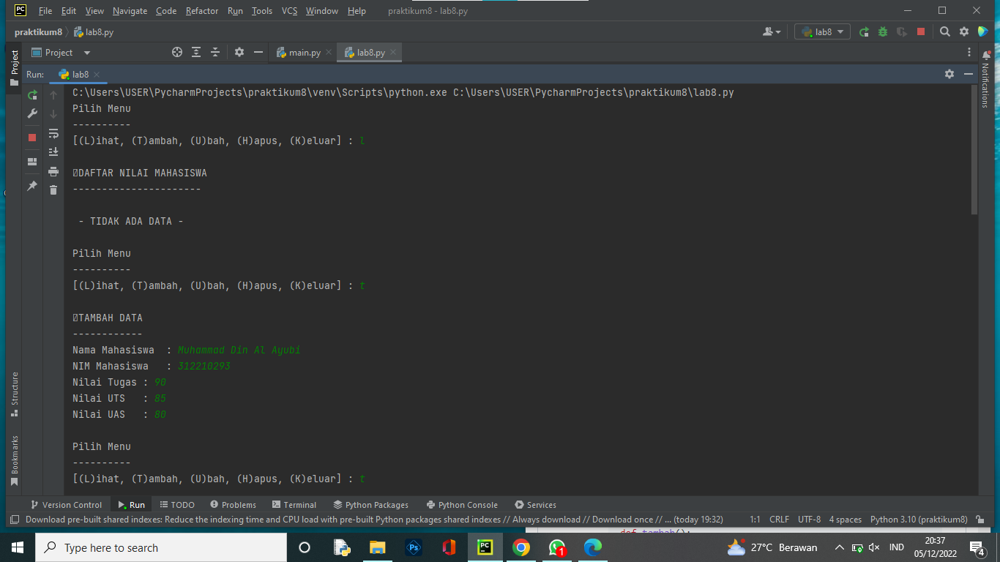
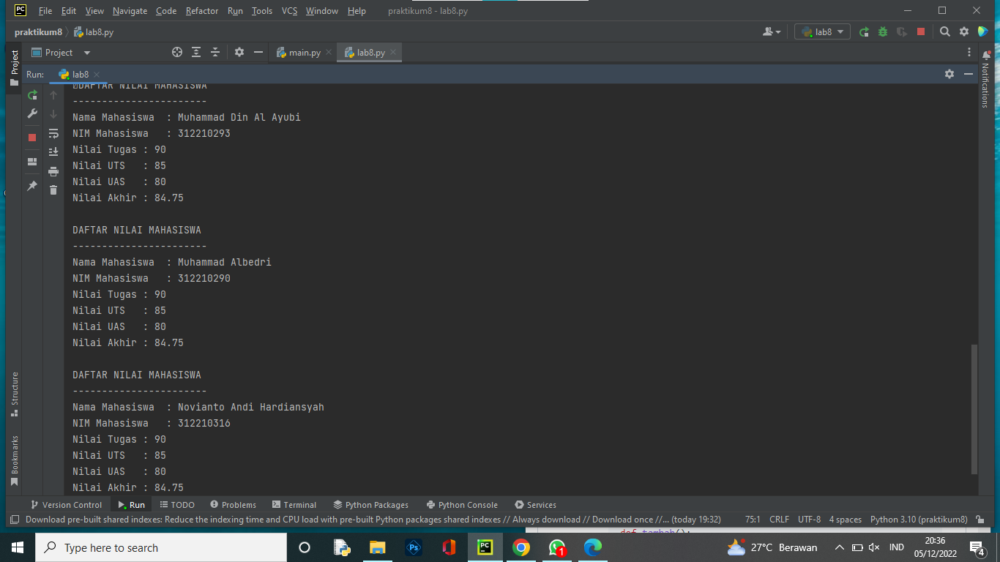

# Praktikum 7
# Nama : Muhammad Din Al Ayubi
# NIM : 312210293
# Kelas : TI 22 A3
## TUGAS PRAKTIKUM 7

## Penjelasan
+ Untuk memanggil fungsi dengan nama "os".
```python
import os
```
+ Membuat class `data_mhsw` dengan atributnya, yaiutu nama, nim, tugas, uts, dan uas.
```python
class data_mhsw:
    nama=""
    nim=""
    tugas=""
    uts=""
    uas=""
```
+ Membuat variabel `data = []` untuk menampung list dari `data_mhsw`.
```python
data = []
```
+ Membuat fungsi tambahan jika diperlukan fun gsi tersebut akan dipanggil oleh program.
```python
def no_data():
    print("DAFTAR NILAI MAHASISWA")
    print("----------------------")
    print()
    print(" - TIDAK ADA DATA - ")
    print()
```
+ Menampilkan data (***lihat()***)
* Jika belum menginput data, makan akan memanggil fungsi `no_data()`.
* Jika sebelumnya sudah menginput data, maka data sudah diinputkan akan di tampilkan oleh program.
```python
def lihat():
    os.system("cls")
    if len(data) <=0:
        no_data()
    else:
        for a in data:
            print("DAFTAR NILAI MAHASISWA")
            print("-----------------------")
            print("Nama Mahasiswa\t: "+a.nama)
            print("NIM Mahasiswa\t: "+str(a.nim))
            print("Nilai Tugas\t: "+str(a.tugas))
            print("Nilai UTS\t: "+str(a.uts))
            print("Nilai UAS\t: "+str(a.uas))
            print("Nilai Akhir\t: "+str(a.akhir))
            print()
```
+ Menambahkan data (***Tambah()***)
* Menginput NIM, NAMA, Nilai Tugas, Nilai UTS, Nilai UAS.
* Jika data sudah diinpit akan ditambahkan kedalam variabel `data`.
```python
def tambah():
    os.system("cls")
    b = data_mhsw()
    print("TAMBAH DATA")
    print("------------")
    b.nama = (input("Nama Mahasiswa\t: "))
    b.nim = (int(input("NIM Mahasiswa\t: ")))
    b.tugas = (int(input("Nilai Tugas\t: ")))
    b.uts = (int(input("Nilai UTS\t: ")))
    b.uas = (int(input("Nilai UAS\t: ")))
    b.akhir = (b.tugas*30/100) + (b.uts*35/100) + (b.uas*35/100)
    data.append(b)
    print()
```
+ Mengubah data (***Ubah()***)
* Menginput Nama, kemudian input data yang ingin di ubah.
```python
def ubah():
    os.system("cls")
    if len(data) <=0:
        no_data()
    else:
        nama = data_mhsw()
        print("UBAH DATA")
        print("---------")
        nama = (input("Nama Mahasiswa\t: "))
        for nama in data:
            nama.tugas = (int(input("Nilai Tugas\t: ")))
            nama.uts = (int(input("Nilai UTS\t: ")))
            nama.uas = (int(input("Nilai UAS\t: ")))
            akhir = (nama.tugas*30/100) + (nama.uts*35/100) + (nama.uas*35/100)
        print()
```
+ Menghapus data (***Hapus()***)
* Menginput Nama, setalah Nama diinputkan maka data yang lainnya akan ikut terhapus sesuai dengan nama yang diinputkan.
```python
def hapus():
    os.system("cls")
    if len(data) <=0:
        no_data()
    else:
        nama = data_mhsw()
        print("HAPUS DATA")
        print("----------")
        nama = (input("Nama Mahasiswa\t: "))
        for nama in data:
            data.remove(nama)
        print()
```
+ Menggunakan Perulangan uncountable, yang artinya selama statement bernilai `True` maka program akan terus berjalan. Jika statementnya `False` maka program akan terhenti.
```python
Loop = True
while Loop:
    print("Pilih Menu")
    print("----------")
    tanya = input("[(L)ihat, (T)ambah, (U)bah, (H)apus, (K)eluar] : ")
    print()
    if tanya == "l" or tanya == "L":
        lihat()

    elif tanya == "t" or tanya == "T":
        tambah()

    elif tanya == "u" or tanya == "U":
        ubah()

    elif tanya == "h" or tanya == "H":
        hapus()

    elif tanya == "k" or tanya == "K":
        print("Program Selesai")
        Loop = False
```
## Hasil Output


***SELESAI***